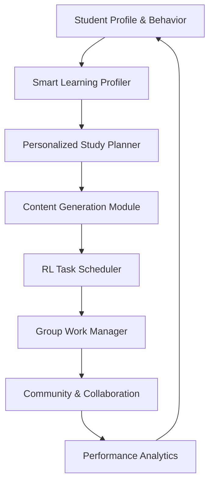

<div align="center">

# 🎓 HelpMate - AI-Based Personalized Learning & Wellness Assistant

### *Transforming Academic Experience Through Intelligent Automation*

[](https://github.com)
[](LICENSE)
[](https://www.sliit.lk)

**Project ID:** 25-26J-228  
**Research Group:** CoEAI - Centre of Excellence for AI  
**Specialization:** Information Technology


</div>

---

## 📋 Table of Contents

- [Overview](#-overview)
- [The Problem](#-the-problem)
- [The Solution](#-the-solution)
- [System Modules](#-system-modules)
  - [Module 1: Intelligent Study Content Generation](#1%EF%B8%8F⃣-intelligent-study-content-generation-module)
  - [Module 2: Smart Academic Group Work Management](#2%EF%B8%8F⃣-smart-academic-group-work-management-system)
  - [Module 3: Adaptive Student Task Scheduler](#3%EF%B8%8F⃣-adaptive-student-task-scheduler-with-reinforcement-learning)
  - [Module 4: Community & Collaboration Zone](#4%EF%B8%8F⃣-community--collaboration-zone)
- [System Architecture](#-system-architecture)
- [Tech Stack](#-tech-stack)
- [Innovation Highlights](#-innovation-highlights)
- [Installation & Setup](#%EF%B8%8F-installation--setup)
- [Research Objectives](#-research-objectives)
- [Team](#-team)
- [Future Enhancements](#-future-enhancements)
- [References](#-references)

---

## 🌟 Overview

HelpMate is an **all-in-one AI-powered platform** designed to revolutionize the academic experience for undergraduate students in Sri Lankan universities. It integrates intelligent academic planning, wellness guidance, collaborative learning, and performance analytics into a unified, adaptive ecosystem.

<div align="center">

</div>

### 🎯 What Makes HelpMate Special?

> **An integrated, AI-driven solution** that merges academic personalization with emotional intelligence and peer-to-peer interaction in a responsive environment.

HelpMate addresses the fragmented nature of current educational tools by providing:
- ✅ **Personalized Study Planning** with AI-driven content generation
- ✅ **Fair Group Work Management** with contribution tracking
- ✅ **Intelligent Task Scheduling** using Reinforcement Learning
- ✅ **Peer Collaboration** through ML-based matching
- ✅ **Emotional Wellness Support** with mood tracking
- ✅ **Career Path Guidance** with CV analysis and job matching

---

## 🔴 The Problem

### Challenges Faced by Students Today

<table>
<tr>
<td width="50%">

#### 📚 Academic Struggles
- Overwhelming volume of content without structured tools
- Difficulty converting notes into active learning
- Poor time management and procrastination
- Inability to identify weak topics early
- Last-minute cramming and exam anxiety

</td>
<td width="50%">

#### 👥 Collaboration Issues
- **Free-riding in group projects**
- Lack of transparency in contribution tracking
- Unfair academic evaluation
- Poor coordination among team members
- Difficulty finding compatible study partners

</td>
</tr>
<tr>
<td width="50%">

#### ⏰ Planning & Productivity
- Static to-do lists that don't adapt
- No consideration of energy patterns
- Inefficient task prioritization
- Ignoring fatigue and subject difficulty
- One-size-fits-all scheduling approaches

</td>
<td width="50%">

#### 🎯 Career & Community
- Fragmented digital resources
- Lack of mentorship networks
- No career path guidance
- Isolated learning experiences
- Missing skill gap identification

</td>
</tr>
</table>

<div align="center">

</div>

### 🎓 Research Gap

Traditional learning platforms focus solely on content delivery, with **no regard for individual needs, emotional factors, or collaborative dynamics**. Existing tools operate in isolation, forcing students to juggle multiple disconnected applications without adaptive intelligence.

---

## ✨ The Solution

### HelpMate: Four Integrated AI Modules

<div align="center">

</div>

HelpMate brings together **four fundamental components** under one intelligent roof:



---

## 🧩 System Modules

## 1️⃣ Intelligent Study Content Generation Module

<div align="center">

</div>

### 🎯 Purpose

Automatically transforms uploaded lecture materials into interactive learning assets—quizzes, flashcards, and summarized notes—while intelligently aligning delivery with exam deadlines.

### ✨ Key Features

#### 📄 **Lecture Note Upload & Processing**
- Upload PDFs via drag-and-drop interface
- Secure storage using **Multer**
- Text extraction with **pdf-parse**
- Automatic cleaning and segmentation

#### 🤖 **AI-Powered Generation** (Fine-tuned T5 Model)

<table>
<tr>
<td width="33%">

**📝 MCQ Generation**
```
Q: What is normalization?
A) Data encryption
B) Reducing redundancy ✓
C) Query optimization
D) Index creation
```

</td>
<td width="33%">

**🗂️ Flashcards**
```
Front: ACID Properties

Back: Atomicity, 
Consistency, Isolation, 
Durability
```

</td>
<td width="33%">

**📄 Summaries**
```
Abstractive summary 
using BART/T5:

"Database normalization 
eliminates redundancy 
through normal forms..."
```

</td>
</tr>
</table>

#### 📅 **Deadline-Based Adaptive Delivery**

| Time Until Exam | Strategy | Frequency |
|----------------|----------|-----------|
| **> 3 weeks** | Generate all content | Weekly reviews |
| **2–3 weeks** | Spaced repetition | Every 5 days |
| **1–2 weeks** | Focus weak areas | Every 2-3 days |
| **< 1 week** | Intensive revision | Daily drills |

#### 🎯 **Interactive Quiz Engine**
- Multiple-choice interface with instant feedback
- Score tracking and weak topic detection
- Performance data feeds into prediction models

<div align="center">

</div>

### 🔬 Technical Implementation

```javascript
// Content Generation Pipeline
Upload PDF → Extract Text → NLP Processing (T5/BERT) 
→ Generate MCQs/Flashcards/Summaries → Store → Schedule Delivery
→ Track Performance → Feed Prediction Engine
```

**Tech Stack:**
- **NLP Models:** Fine-tuned T5-base, BERT, BART
- **Backend:** Node.js, Express, Python Flask
- **Processing:** spaCy, Hugging Face Transformers

---

## 2️⃣ Smart Academic Group Work Management

<div align="center">

</div>

### 🎯 Purpose

The Smart Academic Group Work Management is designed to make group projects fair, transparent, and efficient. It ensures that every member’s contribution is tracked, deadlines are respected, and supervisors can evaluate performance based on clear data.
At its core, the system combines task lifecycle management, proof submission tracking, and contribution analytics to solve the problem of free‑riding and unfair grading in academic group work.

### ✨ Key Features

#### 📝 **Project & Task Management**
- Create and manage group projects
- Assign tasks to members with deadlines and proof
- Track completion status in real-time
- **Group project dashboard** for coordination
- Student self-management tools with performance dashboard and quick workload summery 

<div align="center">

</div>

#### 📊 **Contribution & Performance Tracking**
```
Metrics Tracked:
├── Number of tasks completed
├── task completion duration
├── Active time (project interactions, task interactions)
├── Task complexity 
└── project complexity 
```

#### 🔍 **Free-Riding Detection** (Rule-Based)

Identifies low participation using:
- **Active time** significantly below team average
- **Task completion count** outliers
- **Contribution percentage** thresholds
- display on project dashboard for project members and supervisors

#### 📈 **Analytics Dashboard**

<table>
<tr>
<td width="50%">

**Quick Overview Cards**
- 📊 Total open projects
- ✅ To-do tasks
- 🔄 Ongoing tasks
- 📅 Upcoming deadlines

</td>
<td width="50%">

**Visual Insights**
- 🥯 Donut charts for task distribution
- 📊 Line charts for daily activity
- 📈 Project-wise activity filters
- ⏰ Last active timestamps

</td>
</tr>
</table>

<div align="center">

</div>

#### 🤖 **ML-Based Contribution Scoring**

```python
# Research Component: Predictive Scoring
Model: Random Forest / Gradient Boosting
Features: [active_time, tasks_completed, complexity_score, 
          interaction_frequency, commit_history]
Output: Contribution Score (0-100)
Training: FastAPI + Google Colab
```

- **Training separate from main system**
- Predictions used for scoring only (not decision-making)
- Frontend displays predicted contribution scores
- Helps supervisors make informed evaluations

### 🔬 Technical Implementation

**Backend:** Node.js, Express  
**ML Server:** Python FastAPI  
**Visualization:** Chart.js, D3.js  
**Database:** Firebase Firestore

---

## 3️⃣ Adaptive Student Task Scheduler with Reinforcement Learning

<div align="center">

</div>

### 🎯 Purpose

An intelligent, personalized study planner that fights procrastination by **learning your energy patterns** using Reinforcement Learning.

### 💡 The Innovation

> Traditional to-do lists are static. They don't care if you're tired, overwhelmed, or biased against Math.

This **Next-Generation Scheduler** uses RL to dynamically generate daily study plans by learning:
- 🌅 Are you a **morning person** or **night owl**?
- ⏱️ Do you **underestimate** coding assignment durations?
- 😴 Are you too **fatigued** for a Difficulty-5 Physics task right now?

### ✨ Key Features

#### 🤖 **PPO Reinforcement Learning Agent**

```python
State Space:
├── Current fatigue level (0-10)
├── Time of day (0-23)
├── Subject difficulty (1-5)
├── Recent focus ratings
├── Deadline urgency
└── Historical completion rates

Action Space:
├── Schedule task in time slot
├── Skip to next slot
└── Mark break time

Reward Function:
R = α(task_completion) + β(focus_quality) 
    - γ(deadline_penalty) - δ(fatigue_violation)
```

**Training Process:**
- Tracks **Pomodoro sessions** (25-min focus blocks)
- Records **focus ratings** after each session
- Learns **subject-level strengths/weaknesses**
- Adapts to **energy patterns** over time

<div align="center">

</div>

#### 📊 **The Pepsi Challenge: AI vs. Heuristic**

<table>
<tr>
<th>Method</th>
<th>Approach</th>
<th>Advantages</th>
<th>Limitations</th>
</tr>
<tr>
<td>🎯 <b>Heuristic Baseline</b></td>
<td>Priority + Deadline Greedy Algorithm</td>
<td>
• Fast execution<br>
• Predictable results<br>
• Easy to understand
</td>
<td>
• Rigid ordering<br>
• Ignores energy levels<br>
• No personalization
</td>
</tr>
<tr>
<td>🤖 <b>RL Agent</b></td>
<td>PPO-based Dynamic Scheduling</td>
<td>
• Adapts to fatigue<br>
• Learns preferences<br>
• Optimizes long-term productivity
</td>
<td>
• Requires training data<br>
• Computationally intensive<br>
• Black-box decisions
</td>
</tr>
</table>

#### 📡 **API Endpoints for Testing**

```bash
# Get Heuristic Schedule (Baseline)
GET /api/schedule/heuristic
# Result: Strict deadline ordering - efficient but rigid

# Get AI Schedule (RL Agent)
GET /api/schedule/rl
# Result: Dynamic ordering by priority + energy patterns
```

#### ⏰ **Smart Task Management**

- Tasks divided into **25-minute Pomodoro sessions**
- **In-progress tasks** stay prioritized (momentum maintenance)
- **Exam-linked tasks** get higher urgency
- Respects **sleep schedules** and **class timings**
- Avoids **reward hacking** through balanced objectives

<div align="center">

</div>

### 🔬 Technical Implementation

**RL Framework:** Stable-Baselines3 (PPO)  
**Backend:** Node.js, Express  
**Training:** Python, TensorFlow/PyTorch  
**State Management:** Redis for fast lookups  
**Deployment:** Separate microservice architecture

---

## 4️⃣ Community & Collaboration Zone

<div align="center">

</div>

### 🎯 Purpose

Facilitate peer collaboration, mentorship networks, and career development through intelligent matching algorithms and CV analysis.

### ✨ Key Features

#### 🤝 **Peer Matching via K-Means Clustering**

<div align="center">

</div>

**Mathematical Foundation:**

The algorithm minimizes **Within-Cluster Sum of Squares (WCSS)**:

```
WCSS = Σ(i=1 to k) Σ(x ∈ Ci) ||x - μi||²

where:
- k = number of clusters
- Ci = cluster i
- μi = centroid of cluster i
- x = student profile vector
```

**Implementation Process:**
1. **Data Vectorization:** Convert student profiles (interests, skills, goals) into numerical vectors
2. **Clustering:** Use `ml-kmeans` library to partition students into k groups
3. **Matching:** Assign students to clusters with nearest centroid
4. **Refinement:** Self-improving algorithm with reinforcement learning

**Features Considered:**
- Academic interests and specialization
- Programming language proficiency
- Project experience and skills
- Learning style preferences
- Availability and timezone

#### 🎓 **Mentorship Network**

- **Senior-Junior Pairing:** Connect experienced students with newcomers
- **Adaptive Pairing:** Dynamic adjustment based on interaction quality
- **Academic Guidance:** Domain expertise sharing
- **Skill Development:** Collaborative learning opportunities
- **Compatibility Ratings:** Feedback-driven refinement

<div align="center">

</div>

#### 📄 **CV Analysis & Career Path Suggestions**

**PDF Extraction Pipeline:**
```javascript
Upload CV (PDF) → Extract Text (pdf-parse / pdfjs-dist)
→ Pattern Matching (Regex + NLP) → Identify Skills/Experience
→ Compare with Industry Standards → Generate Skill Gap Report
→ Suggest Certifications/Projects → Job API Integration
```

**Components:**

1️⃣ **Text Extraction**
```javascript
const pdfParse = require('pdf-parse');
// Extract raw text streams from PDF
const data = await pdfParse(cvBuffer);
const cvText = data.text;
```

2️⃣ **Pattern Matching & NLP**
```javascript
// Extract key sections using Regex
const skills = extractSection(cvText, /skills?:/i);
const experience = extractSection(cvText, /experience:/i);
const education = extractSection(cvText, /education:/i);
```

3️⃣ **Skill Gap Analysis**
```javascript
// Compare against industry requirements
const requiredSkills = getCareerRequirements(targetRole);
const missingSkills = requiredSkills.filter(
  skill => !skills.includes(skill)
);
```

4️⃣ **Job API Integration**
```javascript
// Asynchronous HTTPS requests to job platforms
const jobResults = await axios.get('https://api.linkedin.com/jobs', {
  params: { skills: extractedSkills, location: 'Sri Lanka' }
});
```

**Supported APIs:**
- 🔗 LinkedIn Jobs API
- 🌐 Indeed API
- 🎯 Adzuna API
- 📊 Glassdoor API

<div align="center">

</div>

#### 📊 **Career Analytics Engine**

- **Personalized Recommendations:** Based on current profile
- **Skill Gap Identification:** What's missing for target roles
- **Market Demand Analysis:** Trending skills in job market
- **Certification Suggestions:** Relevant courses and certifications
- **Predictive Modeling:** Career success probability estimation
- **Learning Path Generation:** Step-by-step skill development plan

#### 🎯 **Goal-Sharing Dashboards**

- Collaborative goal tracking among peers
- Progress visualization and milestones
- Motivational analytics and achievements
- Study group formation tools
- Project collaboration features

### 🔬 Technical Implementation

**Clustering:** `ml-kmeans` (Node.js ML library)  
**PDF Processing:** `pdf-parse`, `pdfjs-dist`  
**NLP:** Basic pattern matching + Regex  
**Job APIs:** `axios` for HTTP requests  
**File Upload:** `multer` middleware  
**Backend:** Node.js, Express

### 📦 Key Dependencies

| Library | Purpose |
|---------|---------|
| `express` | Web framework for API routing |
| `pdf-parse` | Extracting text from CVs |
| `ml-kmeans` | Clustering logic for peer matching |
| `axios` | API calls to job platforms |
| `multer` | Handling PDF uploads |
| `natural` | NLP utilities |
| `compromise` | Text parsing |

---

## 🏗️ System Architecture

### Overall Platform Architecture

<div align="center">

</div>

### Component Flow Diagram

```
┌─────────────────────────────────────────────────────────────┐
│                    React Frontend (Port 3000)                │
│  ┌──────────┐ ┌──────────┐ ┌──────────┐ ┌──────────┐      │
│  │ Content  │ │  Group   │ │    RL    │ │Community │      │
│  │   Gen    │ │   Work   │ │Scheduler │ │   Zone   │      │
│  └──────────┘ └──────────┘ └──────────┘ └──────────┘      │
└────────────────────┬────────────────────────────────────────┘
                     │
          ┌──────────┴──────────┐
          │                     │
┌─────────▼─────────┐  ┌────────▼────────┐
│  Node.js Backend  │  │  Python AI      │
│   (Express API)   │◄─┤  Servers        │
│   Port 8080       │  │  Flask/FastAPI  │
└─────────┬─────────┘  │  Port 4000      │
          │            └─────────────────┘
          │
    ┌─────┴─────┬──────────┬───────────┐
    │           │          │           │
┌───▼───┐ ┌────▼────┐ ┌───▼────┐ ┌───▼────┐
│Firebase│ │ Google  │ │  Redis │ │  Job   │
│  Store │ │Calendar │ │ Cache  │ │  APIs  │
└────────┘ └─────────┘ └────────┘ └────────┘
```

### Microservices Architecture

| Service | Technology | Port | Purpose |
|---------|-----------|------|---------|
| 🎨 **Frontend** | React, HTML5, CSS3 | 3000 | User interface |
| ⚙️ **Main API** | Node.js, Express | 8080 | Core business logic |
| 🤖 **Content Gen AI** | Python, Flask, T5 | 4000 | NLP & content generation |
| 📊 **ML Scoring** | Python, FastAPI | 4001 | Contribution predictions |
| 🧠 **RL Scheduler** | Python, TensorFlow | 4002 | Task scheduling agent |
| 🗄️ **Database** | Firebase Firestore | - | Data persistence |
| 📅 **Calendar** | Google Calendar API | - | Exam scheduling |
| 💾 **Cache** | Redis | 6379 | Fast state lookups |

---

## 💻 Tech Stack

<div align="center">

### Frontend Technologies


### Backend Technologies


### AI & Machine Learning


### Database & Storage


</div>

### Complete Technology Matrix

<table>
<tr>
<th>Category</th>
<th>Technologies</th>
</tr>
<tr>
<td><b>NLP Models</b></td>
<td>T5-base (fine-tuned), BERT, BART, spaCy</td>
</tr>
<tr>
<td><b>ML Algorithms</b></td>
<td>K-Means Clustering, Random Forest, PPO (RL)</td>
</tr>
<tr>
<td><b>Libraries</b></td>
<td>Transformers, Stable-Baselines3, ml-kmeans, pdf-parse</td>
</tr>
<tr>
<td><b>APIs</b></td>
<td>Google Calendar, LinkedIn Jobs, Indeed, Adzuna</td>
</tr>
<tr>
<td><b>DevOps</b></td>
<td>Docker, GitHub Actions, Heroku/AWS</td>
</tr>
</table>

---

## 💡 Innovation Highlights

<div align="center">

</div>

### 🌟 Groundbreaking Features

| Module | Innovation | Impact |
|--------|-----------|--------|
| **📝 Content Generation** | Fine-tuned T5 on educational content | First local system with exam-aware scheduling |
| **👥 Group Management** | ML-based free-rider detection | Fair evaluation through objective metrics |
| **🧠 RL Scheduler** | PPO agent learns energy patterns | Personalized planning beats static to-do lists |
| **🤝 Peer Matching** | K-Means clustering on profile vectors | Intelligent collaboration > random grouping |
| **📄 CV Analysis** | Automated skill gap identification | Career guidance with job market integration |
| **🔄 Closed-Loop System** | All modules feed each other | Holistic improvement > isolated tools |

### 🚀 Competitive Advantages

<table>
<tr>
<td width="50%">

#### vs. Traditional Tools
✅ **Fully automated** vs. manual input  
✅ **Adaptive** vs. static scheduling  
✅ **Integrated** vs. fragmented apps  
✅ **AI-driven** vs. rule-based  
✅ **Predictive** vs. reactive  

</td>
<td width="50%">

#### vs. Generic AI Tools
✅ **Domain-specific training** vs. prompts  
✅ **Behavioral learning** vs. one-shot  
✅ **Multi-agent ecosystem** vs. single tool  
✅ **Sri Lankan context** vs. global generic  
✅ **Educational psychology** vs. pure tech  

</td>
</tr>
</table>

### 🎯 Research Contributions

1. **Novel RL Application** in academic task scheduling with fatigue modeling
2. **Hybrid Evaluation** framework (The Pepsi Challenge: AI vs. Heuristic)
3. **Multi-dimensional clustering** for peer matching beyond simple attributes
4. **Closed-loop learning** where all modules enhance each other
5. **Context-aware content delivery** based on deadline proximity
6. **Fair assessment methodology** for group work using ML scoring

> **Unlike Quizlet, Anki, Trello, or ChatGPT wrappers**, HelpMate is a **purpose-built AI ecosystem** designed from the ground up for Sri Lankan undergraduate students.

---

## 🛠️ Installation & Setup

### Prerequisites

```bash
✅ Node.js (v14+)
✅ Python (v3.8+)
✅ npm or yarn
✅ Git
✅ Redis (optional, for caching)
```

### 📦 Clone Repository

```bash
git clone https://github.com/osandalakshitha/helpmate.git
cd helpmate
```

### 🔧 Backend Setup

```bash
cd backend
npm install

# Install dependencies
npm install express multer pdf-parse axios ml-kmeans firebase-admin

npm start  # Runs on port 8080
```

### 🤖 AI Servers Setup

#### Content Generation Server (Port 4000)
```bash
cd ai_servers/content_generation
pip install -r requirements.txt
python app.py
```

**requirements.txt:**
```txt
fastapi
uvicorn
scikit-learn
pandas
numpy
joblib
```

#### RL Scheduler Server (Port 4002)
```bash
cd ai_servers/rl_scheduler
pip install -r requirements.txt
python scheduler_service.py
```

**requirements.txt:**
```txt
stable-baselines3
tensorflow
gym
redis
numpy
```

### 🎨 Frontend Setup

```bash
cd frontend
npm install

# Install additional dependencies
npm install axios chart.js react-router-dom

npm start  # Runs on port 3000
```

### 🔑 Environment Variables

Create `.env` files in respective directories:

**Backend (.env):**
```env
PORT=8080
NODE_ENV=development

# Firebase
FIREBASE_API_KEY=your_firebase_key
FIREBASE_PROJECT_ID=your_project_id

# APIs
GOOGLE_CALENDAR_API_KEY=your_calendar_key
LINKEDIN_API_KEY=your_linkedin_key
INDEED_API_KEY=your_indeed_key

# AI Servers
CONTENT_GEN_URL=http://localhost:4000
ML_SCORING_URL=http://localhost:4001
RL_SCHEDULER_URL=http://localhost:4002

# Redis
REDIS_HOST=localhost
REDIS_PORT=6379
```

**AI Servers (.env):**
```env
FLASK_PORT=4000
MODEL_PATH=./models/t5-base-finetuned
DEVICE=cuda  # or 'cpu'
```

### 🚀 Quick Start with Docker (Optional)

```bash
# Build all services
docker-compose up --build

# Or run individually
docker-compose up frontend
docker-compose up backend
docker-compose up ai-services
```

---

## 📖 Usage Guide

### Module 1: Content Generation

<div align="center">

</div>

1. **Upload Notes:** Navigate to `/upload` and drag-drop PDFs
2. **Set Exam Date:** Input deadline in dashboard
3. **Review Content:** Access generated MCQs, flashcards, summaries
4. **Take Quizzes:** Complete assessments and track scores

### Module 2: Group Work Management

<div align="center">

</div>

1. **Create Project:** Set up group project with members
2. **Assign Tasks:** Distribute work with deadlines
3. **Track Activity:** Monitor contribution in real-time
4. **View Analytics:** Check individual performance metrics
5. **Generate Reports:** Export contribution summaries

### Module 3: RL Task Scheduler

<div align="center">

</div>

1. **Add Tasks:** Input assignments with deadlines and difficulty
2. **Get Schedule:** Compare AI vs. Heuristic plans
3. **Complete Pomodoros:** Work in 25-min blocks
4. **Rate Focus:** Provide feedback after sessions
5. **Agent Learns:** System adapts to your patterns

### Module 4: Community & Career

<div align="center">

</div>

1. **Upload CV:** Submit resume for analysis
2. **View Matches:** See compatible study partners
3. **Skill Gaps:** Review missing competencies
4. **Job Suggestions:** Browse relevant opportunities
5. **Connect:** Join study groups or find mentors

---

## 🎯 Research Objectives

### Main Objective

> To develop **HelpMate** — an integrated, AI-based platform that combines personalized study planning, fair group work management, intelligent task scheduling, and peer collaboration to enhance academic outcomes and emotional well-being for undergraduate students.

### Module-Specific Objectives

<table>
<tr>
<th>Member</th>
<th>Module</th>
<th>Sub-Objectives</th>
<th>Novelty</th>
</tr>
<tr>
<td><b>S. N. Ilukwaththage</b><br>IT22609908</td>
<td>Smart Learning Profiler</td>
<td>
• Classify learning styles using ML<br>
• Generate dynamic study plans<br>
• Predict academic performance<br>
• Integrate behavior tracking
</td>
<td>AI-driven learning style identification with behavior-based performance prediction</td>
</tr>
<tr>
<td><b>S.M.O.L. Chamikara</b><br>IT22596734</td>
<td>Content Generation & Productivity</td>
<td>
• Implement NLP-based flashcard/MCQ generator<br>
• Develop smart task manager with reminders<br>
• Enable short note generation<br>
• Track progress visually
</td>
<td>Combines personalized content generation with interactive productivity tools and deadline-aware delivery</td>
</tr>
<tr>
<td><b>R.A.D.B. Vishmi</b><br>IT22926326</td>
<td>Wellness & Emotion Assistant</td>
<td>
• Build mood tracking interface<br>
• Integrate emotion detection (NLP)<br>
• Design habit tracker<br>
• Create relaxation tools
</td>
<td>Adds mood-awareness to academic tools using sentiment-based journaling insights</td>
</tr>
<tr>
<td><b>M.M. Sandeep</b><br>IT22221100</td>
<td>Community & Collaboration</td>
<td>
• Implement smart peer matching (K-Means)<br>
• Build mentorship network<br>
• Create career analytics engine<br>
• Develop CV analysis system
</td>
<td>Self-improving algorithm with RL for peer matching + predictive career modeling with skill gap analysis</td>
</tr>
</table>

---

## 📅 Project Timeline

<div align="center">

</div>

| Week | Phase | Deliverables |
|------|-------|-------------|
| **1-2** | 📋 **Planning** | Requirements gathering, feasibility study, dataset collection |
| **3-4** | 🎨 **Design** | System architecture, UI/UX wireframes, API specifications, database schema |
| **5-6** | 🤖 **AI Development** | T5 fine-tuning, K-Means implementation, RL agent training |
| **7-8** | 💻 **Implementation** | Module development, API integration, frontend components |
| **9-10** | 🔗 **Integration** | Multi-agent communication, calendar sync, testing workflows |
| **11-12** | 🧪 **Testing & Deployment** | User testing, performance optimization, documentation, launch |

### Methodology: Agile-Scrum
- **2-week sprints** with sprint reviews
- **Daily standups** for team coordination
- **Peer code reviews** before merging
- **Continuous integration** with GitHub Actions

---

## 👥 Team

<div align="center">

### 🎓 HelpMate Research Group - SLIIT

</div>

<table>
<tr>
<td align="center" width="25%">
<br>
<b>S. N. Ilukwaththage</b><br>
<sub>IT22609908</sub><br>
<i>🧠 Smart Learning Profiler<br>& Performance Prediction</i><br>
<br>
📧 <a href="mailto:it22609908@my.sliit.lk">Email</a>
</td>
<td align="center" width="25%">
<br>
<b>S.M.O.L. Chamikara</b><br>
<sub>IT22596734</sub><br>
<i>📝 Intelligent Content Generation<br>& Resource Management</i><br>
<br>
📧 <a href="mailto:it22596734@my.sliit.lk">Email</a>
</td>
<td align="center" width="25%">
<br>
<b>R.A.D.B. Vishmi</b><br>
<sub>IT22926326</sub><br>
<i>💚 Academic Wellness<br>& Emotion Assistant</i><br>
<br>
📧 <a href="mailto:it22926326@my.sliit.lk">Email</a>
</td>
<td align="center" width="25%">
<br>
<b>M.M. Sandeep</b><br>
<sub>IT22221100</sub><br>
<i>🤝 Community & Collaboration<br>Zone with Career Analytics</i><br>
<br>
📧 <a href="mailto:it22221100@my.sliit.lk">Email</a>
</td>
</tr>
</table>

<div align="center">

### 👩‍🏫 Supervision Team

**Supervisor:** Mrs. Uthpala Samarakoon  
**Co-Supervisor:** Ms. Tharushi Rubasinghe  

---

**Institution:** Sri Lanka Institute of Information Technology (SLIIT)  
**Faculty:** Faculty of Computing  
**Research Group:** CoEAI - Centre of Excellence for AI  
**Year:** 2025

</div>

---

## 🔮 Future Enhancements

<div align="center">

</div>

### Phase 1: Enhanced Intelligence (Q1 2026)

| Feature | Description | Priority |
|---------|-------------|----------|
| 🔍 **OCR Support** | Extract text from scanned PDFs using Tesseract.js | High |
| 🎙️ **Voice Notes** | Audio lecture transcription and summarization | High |
| 📊 **Advanced Analytics** | Predictive GPA calculator based on current performance | High |
| 🌐 **Multi-language** | Support for Sinhala and Tamil content | Medium |

### Phase 2: Collaboration 2.0 (Q2 2026)

| Feature | Description | Priority |
|---------|-------------|----------|
| 🎮 **Gamification** | XP, badges, leaderboards for motivation | High |
| 📱 **Mobile Apps** | Native iOS/Android applications | High |
| 🤝 **Live Study Rooms** | Virtual co-working spaces with video | Medium |
| 💬 **Real-time Chat** | Integrated messaging for study groups | Medium |
| 🏆 **Competitions** | Quiz tournaments and coding challenges | Low |

### Phase 3: Advanced AI (Q3 2026)

| Feature | Description | Priority |
|---------|-------------|----------|
| 🧠 **GPT Integration** | Advanced question answering on notes | High |
| 🎯 **Personalized Tutoring** | AI tutor for concept clarification | High |
| 📈 **Predictive Interventions** | Early warning system for at-risk students | High |
| 🔮 **Career Path Simulator** | AI-powered career trajectory modeling | Medium |
| 🎨 **Auto Diagram Generation** | Convert text to visual flowcharts | Low |

### Phase 4: Institutional Integration (Q4 2026)

| Feature | Description | Priority |
|---------|-------------|----------|
| 🏫 **LMS Integration** | Connect with Moodle, Canvas, Blackboard | High |
| 📚 **Library API** | Access university digital resources | Medium |
| 👨‍🏫 **Faculty Portal** | Teacher dashboard for monitoring | Medium |
| 📊 **Institution Analytics** | Department-wide performance insights | Medium |
| 🎓 **Graduation Pathway** | Automated degree requirement tracking | Low |

---

## 🐛 Challenges Overcome

<div align="center">

</div>

<table>
<tr>
<th width="30%">Challenge</th>
<th width="70%">Solution</th>
</tr>
<tr>
<td>🔥 <b>MCQ Quality</b></td>
<td>Fine-tuned T5 on domain-specific educational Q&A pairs + implemented diversity sampling and deduplication logic</td>
</tr>
<tr>
<td>⚡ <b>RL Agent Convergence</b></td>
<td>Balanced reward function to prevent reward hacking + added entropy bonus for exploration</td>
</tr>
<tr>
<td>👥 <b>Free-Rider Detection Accuracy</b></td>
<td>Combined multiple metrics (time, tasks, complexity) + statistical outlier detection with configurable thresholds</td>
</tr>
<tr>
<td>🔗 <b>Module Integration</b></td>
<td>Microservices architecture with REST APIs + event-driven communication via Redis pub/sub</td>
</tr>
<tr>
<td>📄 <b>PDF Text Extraction</b></td>
<td>Multi-library approach: pdf-parse for text, pdfjs-dist for scanned docs + text cleaning pipeline</td>
</tr>
<tr>
<td>🎯 <b>Clustering Optimization</b></td>
<td>Elbow method for optimal k + silhouette score validation + feature engineering for better separation</td>
</tr>
<tr>
<td>⏱️ <b>Real-time Performance</b></td>
<td>Redis caching layer + model quantization + asynchronous processing with worker queues</td>
</tr>
<tr>
<td>🔐 <b>Data Privacy</b></td>
<td>End-to-end encryption + anonymized analytics + GDPR-compliant data handling</td>
</tr>
</table>

---

## 💰 Budget & Resources

### Development Budget

| Expense | Cost (LKR) | Justification |
|---------|-----------|---------------|
| ☁️ **Cloud Hosting** | 8,000 | Firebase (backend, database), Heroku (AI servers) |
| 🌐 **Domain & SSL** | 2,500 | Professional web presence + security certificate |
| 🤖 **API Credits** | 5,000 | LinkedIn/Indeed APIs, Google Calendar, OCR services |
| 💾 **Storage** | 3,000 | PDF storage, model weights, user data |
| 📚 **Datasets** | 2,000 | Educational Q&A corpus, job listings data |
| 📄 **Documentation** | 1,500 | Reports, printing, presentation materials |
| **Total** | **22,000** | Reasonable for 4-person research project |

### Computational Resources

- **Training:** Google Colab Pro (free tier + paid sessions)
- **Inference:** Local servers + cloud deployment
- **Storage:** Firebase (5GB free) + AWS S3 (pay-as-you-go)

---

## 📚 References

### Academic Papers

1. **Karpicke, J. D., & Roediger, H. L.** (2008). *The critical importance of retrieval for learning.* Science, 319(5865), 966–968.

2. **Laban, C., et al.** (2022). *Question Generation: A Review.* ACM Computing Surveys.

3. **See, A., Liu, P. J., & Manning, C. D.** (2017). *Get to the point: Summarization with pointer-generator networks.* ACL.

4. **Pane, J. F., Steiner, E. D., Baird, M. D., & Hamilton, L. S.** (2015). *Continued Progress: Promising Evidence on Personalized Learning.* RAND Corporation.

5. **Keyes, C. L. M.** (2007). *Promoting and protecting mental health as flourishing.* American Psychologist, 62(2), 95–108.

6. **Schulman, J., Wolski, F., Dhariwal, P., Radford, A., & Klimov, O.** (2017). *Proximal Policy Optimization Algorithms.* arXiv preprint arXiv:1707.06347.

7. **MacQueen, J.** (1967). *Some methods for classification and analysis of multivariate observations.* Proceedings of the Fifth Berkeley Symposium on Mathematical Statistics and Probability, Volume 1: Statistics, 281--297.

### Technical Documentation

8. **Hugging Face.** (2023). *Transformers Library.* https://huggingface.co/transformers

9. **OpenAI.** (2023). *Reinforcement Learning with Human Feedback.* https://openai.com/research/learning-from-human-preferences

10. **Google.** (2023). *Google Calendar API Documentation.* https://developers.google.com/calendar

---

## 🤝 Contributing

We welcome contributions from the community! Please read our [Contributing Guidelines](CONTRIBUTING.md) before submitting pull requests.

### Development Workflow

1. Fork the repository
2. Create a feature branch (`git checkout -b feature/AmazingFeature`)
3. Commit your changes (`git commit -m 'Add some AmazingFeature'`)
4. Push to the branch (`git push origin feature/AmazingFeature`)
5. Open a Pull Request

### Code Standards

- **Frontend:** ESLint + Prettier
- **Backend:** Airbnb JavaScript Style Guide
- **Python:** PEP 8
- **Testing:** Jest (JS), pytest (Python)
- **Documentation:** JSDoc, docstrings

---

## 📄 License

This project is developed as part of academic research at SLIIT.

**Project ID:** 25-26J-228  
**Copyright © 2025 HelpMate Research Team**

Licensed under the MIT License - see the [LICENSE](LICENSE) file for details.

---

<div align="center">

## 🎓 Built with 💙 for Sri Lankan Students


### 🌟 Making Higher Education Smarter, Fairer, and More Supportive

---

**⭐ Star this repo if you find it helpful!**

[](https://github.com/osandalakshitha/helpmate)
[](https://github.com/osandalakshitha/helpmate/fork)
[](https://github.com/osandalakshitha/helpmate/issues)

### 📫 Contact Us

**Email:** helpmate.sliit@gmail.com  
**Website:** [helpmate.lk](https://helpmate.lk) (Coming Soon)  
**LinkedIn:** [HelpMate Project](https://linkedin.com/company/helpmate-sliit)

---
