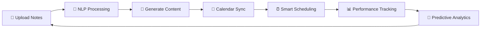

<div align="center">

# 🎓 HelpMate - Intelligent Study Content Generation Module

### *Transforming Passive Learning into Active Success*

[](https://github.com)
[](LICENSE)
[](https://www.sliit.lk)

**Project ID:** 25-26J-228  
**Research Group:** CoEAI - Centre of Excellence for AI  
**Specialization:** Information Technology


</div>

---

## 📋 Table of Contents

- [Overview](#-overview)
- [The Problem](#-the-problem)
- [The Solution](#-the-solution)
- [Key Features](#-key-features)
- [System Architecture](#-system-architecture)
- [Tech Stack](#-tech-stack)
- [Innovation Highlights](#-innovation-highlights)
- [Installation & Setup](#%EF%B8%8F-installation--setup)
- [Usage](#-usage)
- [Research Objectives](#-research-objectives)
- [Project Timeline](#-project-timeline)
- [Team](#-team)
- [Future Enhancements](#-future-enhancements)
- [References](#-references)
- [License](#-license)

---

## 🌟 Overview

HelpMate is an **AI-powered adaptive learning platform** designed to revolutionize academic preparation for undergraduate students in Sri Lankan universities. The **Intelligent Study Content Generation Module** is the core intelligence engine that transforms passive lecture materials into active, personalized learning experiences.

<div align="center">

</div>

### 🎯 What Makes It Special?

> **More than convenience, it offers confidence**: knowing exactly what to study, when to study it, and how well you're progressing.

Unlike generic study tools that require manual input, HelpMate enables **end-to-end automation**, reducing cognitive load while promoting:
- ✅ **Active Recall**
- ✅ **Spaced Repetition**
- ✅ **Metacognitive Awareness**
- ✅ **Predictive Performance Analytics**

---

## 🔴 The Problem

### Challenges Faced by Students

<table>
<tr>
<td width="50%">

#### 📚 Academic Struggles
- Overwhelming volume of lecture content
- Difficulty converting notes into active learning tools
- Poor time management and delayed preparation
- Inability to identify weak topics early

</td>
<td width="50%">

#### 🛠️ Tool Limitations
- Manual effort required for quiz creation
- No integration with performance analytics
- Lack of personalization and adaptation
- Disconnected tools without predictive feedback

</td>
</tr>
</table>

<div align="center">

</div>

### 🎓 Research Gap

Current platforms like **Quizlet**, **Anki**, and **Khan Academy** suffer from:
- ❌ Require manual content input
- ❌ No connection to predictive models
- ❌ Don't adapt to individual learning pace
- ❌ No calendar-aware scheduling
- ❌ Fail to close the loop between assessment and intervention

**HelpMate fills this critical gap** by combining NLP, educational psychology, and machine learning into a unified, intelligent system.

---

## ✨ The Solution

### End-to-End Automated Learning Pipeline

<div align="center">

</div>

HelpMate transforms static lecture notes into an **intelligent, proactive tutoring system** through:



---

## 🚀 Key Features

### 1️⃣ **Lecture Note Upload & Text Extraction**

<div align="center">

</div>

- 📂 Upload PDFs via `/user/notes/upload`
- 🔒 Secure storage using **Multer**
- 📖 Text extraction with **pdf-parse**
- ✂️ Automatic cleaning and segmentation

**Example**: Upload "Database Design.pdf" → extracts concepts like *normalization, primary keys, ACID properties*

---

### 2️⃣ **AI-Powered Content Generation**

Using a **fine-tuned T5-base model** hosted locally, the system generates:

<table>
<tr>
<td width="33%">

#### 📝 Multiple-Choice Questions
```
Question: What is the purpose 
of a foreign key?

Options: 
A) To uniquely identify rows
B) To create relationships 
   between tables ✓
C) To encrypt data
D) To index queries
```

</td>
<td width="33%">

#### 🗂️ Flashcards
```
Front: 
What is normalization?

Back: 
The process of organizing 
data to reduce redundancy 
and improve integrity.
```

</td>
<td width="33%">

#### 📄 Summarized Notes
```
Abstractive Summary:

"Normalization involves 
decomposing tables to 
eliminate redundancy and 
ensure data integrity 
through normal forms..."
```

</td>
</tr>
</table>

<div align="center">

</div>

---

### 3️⃣ **Exam Date Integration & Calendar Sync**

```json
{
  "subject": "Database Systems",
  "examDate": "2026-02-15T09:00:00Z",
  "status": "scheduled"
}
```

<div align="center">

</div>

- 📆 Sync with **Google Calendar**
- ⏰ Automatic deadline detection
- 🔔 Proactive reminder system
- 📊 Visual timeline view

---

### 4️⃣ **Deadline-Based Adaptive Content Delivery**

<div align="center">

| Time Until Exam | 📅 Strategy | 🎯 Focus |
|----------------|------------|---------|
| **> 3 weeks** | Generate all content; weekly review sessions | Build foundation |
| **2–3 weeks** | Low-intensity spaced repetition (every 5 days) | Reinforce concepts |
| **1–2 weeks** | Increase frequency (every 2–3 days) | Target weak areas |
| **< 1 week** | Daily quizzes, flashcard drills | Intensive revision |

</div>

<div align="center">

</div>

#### 🎯 Example Scenario

> **"Database Exam in 5 days"** → System sends daily notifications:  
> 👉 *"Practice 10 MCQs on Normalization today!"*  
> 👉 *"Review flashcards: SQL Joins (20 cards)"*  
> 👉 *"Read summary: Transaction Management"*

---

### 5️⃣ **Interactive Quiz Engine**

<div align="center">

</div>

**Features:**
- ✅ Multiple-choice interface (A/B/C/D)
- ⚡ Instant feedback with explanations
- 📊 Score tracking and analytics
- 🎯 Weak topic detection
- 📈 Progress visualization

**User Flow:**
```
Select Answer → Submit → View Feedback → See Explanation → Track Score → Identify Weak Areas
```

---

### 6️⃣ **Multi-Agent Integration**

<div align="center">

| 📤 Output | 🎯 Destination | 💡 Use Case |
|----------|---------------|------------|
| User quiz scores | Performance Predictor | Detect weak areas & predict outcomes |
| Generated content | Spacing Agent (SM-2) | Schedule optimal review intervals |
| Topic mastery level | Rescheduler Agent | Adjust study plan dynamically |
| Exam date + workload | Focus Window Predictor | Optimize study timing |
| VARK learning profile | Resource Recommender | Personalize content format |

</div>

<div align="center">

</div>

---

## 🏗️ System Architecture

### High-Level Architecture Diagram

<div align="center">

</div>

### Component Flow

```
┌─────────────────┐
│  React Frontend │ (Port 3000)
│  (UI/UX Layer)  │
└────────┬────────┘
         │
         ↓
┌─────────────────┐      ┌──────────────────┐
│  Node.js Backend│◄────►│  Python AI Server│
│   (Express API) │      │  (Flask + T5/BERT)│
│   Port 8080     │      │   Port 4000      │
└────────┬────────┘      └──────────────────┘
         │
         ↓
┌─────────────────┐
│  Firebase Store │
│  (Database)     │
└─────────────────┘
         │
         ↓
┌─────────────────┐
│  Google Calendar│
│      API        │
└─────────────────┘
```

### Key Components

<table>
<tr>
<td>

**Component**

</td>
<td>

**Technology**

</td>
<td>

**Role**

</td>
</tr>
<tr>
<td>📱 Frontend</td>
<td>React.js, HTML5, CSS3</td>
<td>User interface & interaction</td>
</tr>
<tr>
<td>⚙️ Backend</td>
<td>Node.js, Express</td>
<td>API handling, file processing</td>
</tr>
<tr>
<td>🤖 AI Server</td>
<td>Python, Flask, Transformers</td>
<td>NLP processing, content generation</td>
</tr>
<tr>
<td>🗄️ Database</td>
<td>Firebase Firestore</td>
<td>Data storage & retrieval</td>
</tr>
<tr>
<td>📅 Calendar</td>
<td>Google Calendar API</td>
<td>Exam scheduling & reminders</td>
</tr>
<tr>
<td>📄 File Upload</td>
<td>Multer</td>
<td>Secure file handling</td>
</tr>
<tr>
<td>📖 PDF Parser</td>
<td>pdf-parse</td>
<td>Text extraction from PDFs</td>
</tr>
</table>

---

## 💻 Tech Stack

<div align="center">

### Frontend


### Backend


### AI & ML


### Database & Storage


</div>

---

## 💡 Innovation Highlights

<div align="center">

</div>

| 🌟 Feature | 🚀 Why It's Innovative |
|-----------|----------------------|
| **Fine-tuned T5 on Custom Dataset** | Not a prompt hack — real ML training on educational content |
| **Zero Repeated Questions** | Prompt variation + deduplication + diversity sampling |
| **Exam-Aware Scheduling** | First local system linking AI-generated content to deadlines |
| **Closed-Loop Feedback** | Quiz results → prediction → automatic rescheduling |
| **Fully Offline-Capable** | Runs without internet after initial setup |
| **Multi-Agent Integration** | Feeds 5+ intelligent modules for holistic learning |
| **Sri Lankan Context** | Tailored for local university curricula and needs |

> **Unlike Google Gemini or ChatGPT wrappers**, this is a **domain-specific AI pipeline** built from the ground up for Sri Lankan undergraduate students.

---

## 🛠️ Installation & Setup

### Prerequisites

```bash
✅ Node.js (v14+)
✅ Python (v3.8+)
✅ npm or yarn
✅ Git
```

### 📦 Clone Repository

```bash
git clone https://github.com/osandalakshitha/helpmate.git
cd helpmate
```

### 🔧 Backend Setup

```bash
cd backend
npm install
npm start  # Runs on port 8080
```

### 🤖 AI Server Setup

```bash
cd ai_server
pip install -r requirements.txt
python app.py  # Runs on port 4000
```

**Requirements.txt includes:**
```txt
flask
transformers
torch
pdf-parse
spacy
```

### 🎨 Frontend Setup

```bash
cd frontend
npm install
npm start  # Runs on port 3000
```

### 🔑 Environment Variables

Create `.env` files in respective directories:

**Backend (.env):**
```env
PORT=8080
FIREBASE_API_KEY=your_firebase_key
GOOGLE_CALENDAR_API_KEY=your_calendar_key
AI_SERVER_URL=http://localhost:4000
```

**AI Server (.env):**
```env
FLASK_PORT=4000
MODEL_PATH=./models/t5-base-finetuned
```

---

## 📖 Usage

### 1️⃣ Upload Lecture Notes

<div align="center">

</div>

Navigate to `/user/notes/upload` and drag-drop your PDF files.

### 2️⃣ Set Exam Dates

<div align="center">

</div>

Input your exam schedule through the dashboard.

### 3️⃣ Review Generated Content

<div align="center">

</div>

Browse automatically generated:
- 📝 MCQs
- 🗂️ Flashcards  
- 📄 Summary notes

### 4️⃣ Take Quizzes & Track Progress

<div align="center">

</div>

Complete quizzes and view real-time performance analytics.

---

## 🎯 Research Objectives

### Main Objective

> To design and develop the **Intelligent Study Content Generation Module** — a core component of the HelpMate platform — that automatically generates quizzes, flashcards, and summarized notes from uploaded academic content, and integrates with a calendar-based planner and performance prediction system to support personalized exam preparation.

### Specific Objectives

<table>
<tr>
<td width="50%">

#### 🔬 Technical Goals

1. **NLP-Based Content Processor**  
   Extract key concepts, definitions, and relationships from PDFs/PPTs

2. **Deep Learning Content Generation**  
   Generate MCQs with plausible distractors using T5/BART

3. **Summarization Engine**  
   Create concise notes using extractive + abstractive techniques

</td>
<td width="50%">

#### 🎓 Educational Goals

4. **Smart Reminder System**  
   Schedule tasks based on calendar-synced exam dates

5. **Performance Logging**  
   Track quiz scores and review frequency

6. **Predictive Integration**  
   Feed data into Performance Predictor and Strategy Module

</td>
</tr>
</table>

---

## 📅 Project Timeline

<div align="center">

</div>

| Week | Phase | Activities |
|------|-------|-----------|
| **1-2** | 📋 Planning | Requirement gathering, feasibility study |
| **3-4** | 🎨 Design | System architecture, UI/UX wireframes, API design |
| **5-6** | 🤖 AI Development | NLP model setup, T5 fine-tuning |
| **7-8** | 💻 Implementation | Quiz & flashcard generation, summary engine |
| **9-10** | 🔗 Integration | Calendar sync, reminder system, multi-agent connection |
| **11-12** | 🧪 Testing & Deployment | User testing, bug fixes, documentation |

### Methodology: **Agile-Scrum** (2-week sprints)

---

## 👥 Team

<div align="center">

### 🎓 HelpMate Research Group

</div>

<table>
<tr>
<td align="center" width="25%">
<br>
<b>S. N. Ilukwaththage</b><br>
<sub>IT22609908</sub><br>
<i>Smart Learning Profiler</i><br>
📧 <a href="mailto:it22609908@my.sliit.lk">Email</a>
</td>
<td align="center" width="25%">
<br>
<b>S.M.O.L. Chamikara</b><br>
<sub>IT22596734</sub><br>
<i>Content Generation Module</i><br>
📧 <a href="mailto:it22596734@my.sliit.lk">Email</a>
</td>
<td align="center" width="25%">
<br>
<b>R.A.D.B. Vishmi</b><br>
<sub>IT22926326</sub><br>
<i>Wellness & Emotion Assistant</i><br>
📧 <a href="mailto:it22926326@my.sliit.lk">Email</a>
</td>
<td align="center" width="25%">
<br>
<b>M.M. Sandeep</b><br>
<sub>IT22221100</sub><br>
<i>Community & Collaboration</i><br>
📧 <a href="mailto:it22221100@my.sliit.lk">Email</a>
</td>
</tr>
</table>

<div align="center">

### 👩‍🏫 Supervision Team

**Supervisor:** Mrs. Uthpala Samarakoon  
**Co-Supervisor:** Ms. Tharushi Rubasinghe  

**Institution:** Sri Lanka Institute of Information Technology (SLIIT)  
**Research Group:** CoEAI - Centre of Excellence for AI

</div>

---

## 🔮 Future Enhancements

<div align="center">

</div>

| Feature | Description | Priority |
|---------|-------------|----------|
| 🔍 **OCR Support** | Extract text from scanned PDFs using Tesseract.js | High |
| 📝 **BART Summarization** | Enhanced one-page note generation | High |
| 📤 **Flashcard Export** | Export to Anki/Quizlet formats | Medium |
| 📧 **Email Reminders** | Scheduled practice links before exams | Medium |
| 📊 **Progress Dashboard** | Visual mastery tracking per subject over time | High |
| 🎙️ **Audio Summaries** | Text-to-speech for VARK learners | Low |
| 🤝 **Collaborative Study** | Group quiz sessions and peer challenges | Medium |
| 📱 **Mobile App** | Native iOS/Android applications | Future |

---

## 🐛 Challenges Overcome

<div align="center">

</div>

| 🔥 Challenge | ✅ Solution |
|-------------|-----------|
| Options broken across lines | Added `re.sub(r'\s+', ' ', text)` for text normalization |
| Only generating one unique MCQ | Implemented chunking + sampling + diversity settings |
| 500 errors during file upload | Added comprehensive logging, fixed `fs` and CORS configs |
| Port conflicts in team environment | Standardized: Backend 8080, AI Server 4000, Frontend 3000 |
| Model repeating same answers | Built deduplication logic with hash-based tracking |
| Plausible distractor generation | Fine-tuned T5 on domain-specific wrong answer patterns |

---

## 💰 Budget

| Expense | Cost (LKR) | Justification |
|---------|-----------|---------------|
| ☁️ Cloud Hosting (Firebase) | 5,000 | Backend, database, file storage |
| 🌐 Domain & SSL | 2,500 | Professional web presence |
| 🤖 NLP API (Hugging Face) | 3,000 | Optional model hosting |
| 📄 Miscellaneous | 1,500 | Reports, printing, documentation |
| **Total** | **12,000** | Affordable for student research project |

---

## 📚 References

1. **Karpicke, J. D., & Roediger, H. L.** (2008). *The critical importance of retrieval for learning.* Science, 319(5865), 966–968.

2. **Laban, C., et al.** (2022). *Question Generation: A Review.* ACM Computing Surveys.

3. **See, A., Liu, P. J., & Manning, C. D.** (2017). *Get to the point: Summarization with pointer-generator networks.* ACL.

4. **Pane, J. F., Steiner, E. D., Baird, M. D., & Hamilton, L. S.** (2015). *Continued Progress: Promising Evidence on Personalized Learning.* RAND Corporation.

5. **Keyes, C. L. M.** (2007). *Promoting and protecting mental health as flourishing.* American Psychologist, 62(2), 95–108.

6. **Hugging Face.** (2023). *Transformers Library.* https://huggingface.co/transformers

---

## 📄 License

This project is developed as part of academic research at SLIIT.  
**Project ID:** 25-26J-228  
**Copyright © 2025 HelpMate Research Team**

<div align="center">

### 🎓 Built with 💙 for Sri Lankan Students


---

**⭐ Star this repo if you find it helpful!**

[](https://github.com/osandalakshitha/helpmate)
[](https://github.com/osandalakshitha/helpmate/fork)

</div>